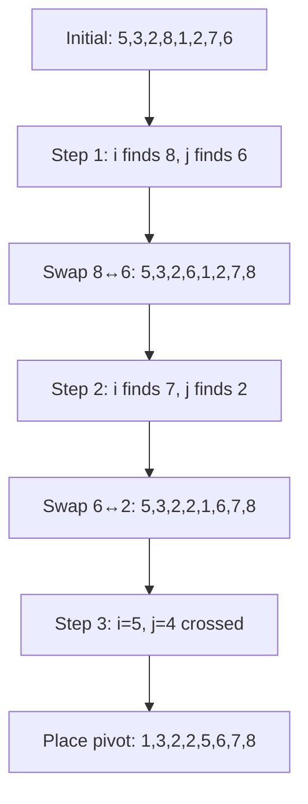
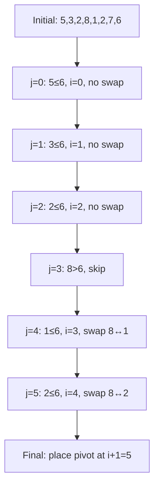
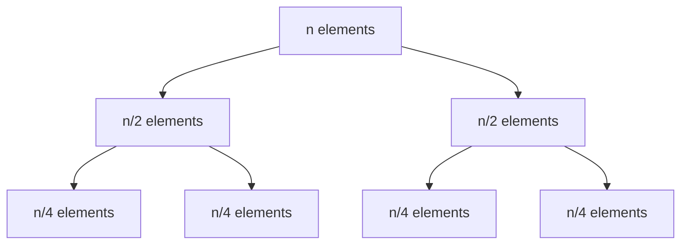
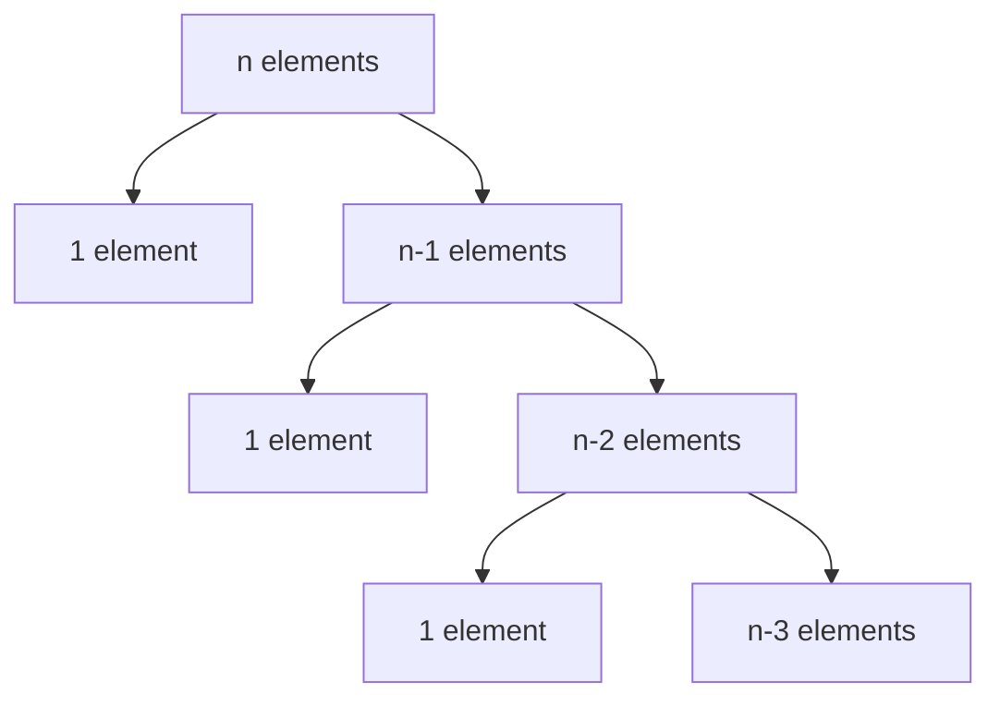

# Quick Sort Algorithm

## Introduction

Quick Sort is a highly efficient **divide-and-conquer** sorting algorithm that works by selecting a pivot element and partitioning the array around it. The algorithm recursively sorts the sub-arrays formed by this partitioning process.

When an input is sorted, many problems become easy to solve (e.g., searching, finding minimum/maximum, finding k-th smallest element).

---

# Quick Sort with First Element as Pivot

## How Quick Sort (First Element Pivot) Works

### Steps:

1. **Choose Pivot**: Select the **first element** of the current sub-array as the pivot
2. **Initialize Pointers**: 
   - `i` starts from left (`l`) and moves right
   - `j` starts from right+1 (`h+1`) and moves left
3. **Partition**:
   - Move `i` right until finding element **≥ pivot**
   - Move `j` left until finding element **≤ pivot**
   - If `i < j`, swap elements at `i` and `j`
   - Repeat until pointers cross
4. **Place Pivot**: Swap pivot with element at position `j`
5. **Recursively Sort**: Apply to left and right sub-arrays

## C++ Implementation - First Element Pivot

```cpp
#pragma once
namespace Algorithms{
  typedef long unsigned int size_t;
  
  template<class T>
  void swap (T& A, T& B) {
    T temp = A;
    A = B;
    B = temp;
  }
  
  template<class T>
  size_t partition_first(T arr[], size_t l, size_t h){
    size_t i = l, j = h + 1;
    T pivot = arr[l];
    while(i < j){
      do { i++; } while(i <= h && pivot >= arr[i]);
      do { j--; } while(j > l && pivot < arr[j]);
      if(i < j){
        swap(arr[i], arr[j]);
      }
    }
    swap(arr[l], arr[j]); 
    return j;
  }
  
  template<class T>
  T* quick_sort_first(T arr[], size_t l, size_t h){
    if(l < h){
      size_t j = partition_first<T>(arr, l, h);
      if(j > l) { quick_sort_first<T>(arr, l, j - 1); }
      if(j < h) { quick_sort_first<T>(arr, j + 1, h); }
    }
    return arr;
  }
}
```

## Example Walkthrough - First Element Pivot

Let's trace the algorithm with the array: `[5, 3, 2, 8, 1, 2, 7, 6]`

### Initial State:
```
Array: [5, 3, 2, 8, 1, 2, 7, 6]
Pivot: 5 (first element)
i = 0, j = 8
```

### Partitioning Process:



### Detailed Steps:

1. **Pivot = 5**, i=0, j=8
2. i moves right: stops at 8 (≥ pivot), position 3
3. j moves left: stops at 6 (≤ pivot), position 7
4. Swap 8↔6: `[5, 3, 2, 6, 1, 2, 7, 8]`
5. i moves right: stops at 7 (≥ pivot), position 6
6. j moves left: stops at 2 (≤ pivot), position 5
7. Swap 6↔2: `[5, 3, 2, 2, 1, 6, 7, 8]`
8. i=5, j=4 (crossed) → place pivot at position 4
9. **Result**: `[1, 3, 2, 2, 5, 6, 7, 8]`

---

# Quick Sort with Last Element as Pivot

## How Quick Sort (Last Element Pivot) Works

### Steps:

1. **Choose Pivot**: Select the **last element** of the current sub-array as the pivot
2. **Initialize Pointer**: 
   - `i` starts from `l-1` (before the beginning)
3. **Partition**:
   - Iterate `j` from `l` to `h-1`
   - If element at `j` ≤ pivot, increment `i` and swap elements at `i` and `j`
4. **Place Pivot**: Swap pivot with element at position `i+1`
5. **Recursively Sort**: Apply to left and right sub-arrays

## C++ Implementation - Last Element Pivot

```cpp
template<class T>
size_t partition_last(T arr[], size_t l, size_t h){
  size_t i = l - 1;
  T pivot = arr[h];
  for(size_t j = l; j < h; ++j){
    if(arr[j] <= pivot){ swap(arr[j], arr[++i]); }
  }
  swap(arr[h], arr[i+1]);
  return i + 1;
}

template<class T>
T* quick_sort_last(T arr[], size_t l, size_t h){
  if(l < h){
    size_t i = partition_last<T>(arr, l, h);
    if(i > l) { quick_sort_last<T>(arr, l, i - 1); }
    if(i < h) { quick_sort_last<T>(arr, i + 1, h); }
  }
  return arr;
}
```

## Example Walkthrough - Last Element Pivot

Let's trace the algorithm with the array: `[5, 3, 2, 8, 1, 2, 7, 6]`

### Initial State:
```
Array: [5, 3, 2, 8, 1, 2, 7, 6]
Pivot: 6 (last element)
i = -1, j starts from 0
```

### Partitioning Process:



### Detailed Steps:

1. **Pivot = 6**, i = -1
2. j=0: 5≤6 → i=0, no swap needed
3. j=1: 3≤6 → i=1, no swap needed  
4. j=2: 2≤6 → i=2, no swap needed
5. j=3: 8>6 → skip, i remains 2
6. j=4: 1≤6 → i=3, swap arr[3]↔arr[4]: `[5, 3, 2, 1, 8, 2, 7, 6]`
7. j=5: 2≤6 → i=4, swap arr[4]↔arr[5]: `[5, 3, 2, 1, 2, 8, 7, 6]`
8. j=6: 7>6 → skip, i remains 4
9. Place pivot: swap arr[7]↔arr[5]: `[5, 3, 2, 1, 2, 6, 7, 8]`
10. **Result**: `[5, 3, 2, 1, 2, 6, 7, 8]`

## Time Complexity Analysis

### Best Case: O(n log n)


**Scenario**: Perfect balanced partitioning at each level
- Each partition splits array into two equal halves
- Recursion depth: log₂n
- Work at each level: O(n)
- **Total**: O(n log n)

### Worst Case: O(n²)


**Scenario**: Highly unbalanced partitioning
- Pivot is always the smallest or largest element
- Recursion depth: n
- Work at each level: O(n)
- **Total**: O(n²)

## Usage Example

```cpp
#include<iostream>
#include"quick_sort.hpp"
using namespace std;

int main (){
  int arr[] = {12, -1, 0, 1, 10, -20};
  
  cout << "The Unsorted Array: ";
  for (size_t i = 0; i < size(arr); ++i) {
    cout << arr[i] << ' ';
  } cout << endl;

  size_t low = 0, high = size(arr) - 1;
  
  // Using first element as pivot
  Algorithms::quick_sort_first(arr, low, high);
  
  // Or using last element as pivot
  // Algorithms::quick_sort_last(arr, low, high);
  
  cout << "The Sorted Array  : ";
  for (size_t i = 0; i < size(arr); ++i) {
    cout << arr[i] << ' '; // Output: -20 -1 0 1 10 12
  } cout << endl;

  return 0;
}
```
